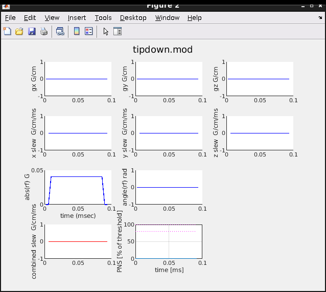
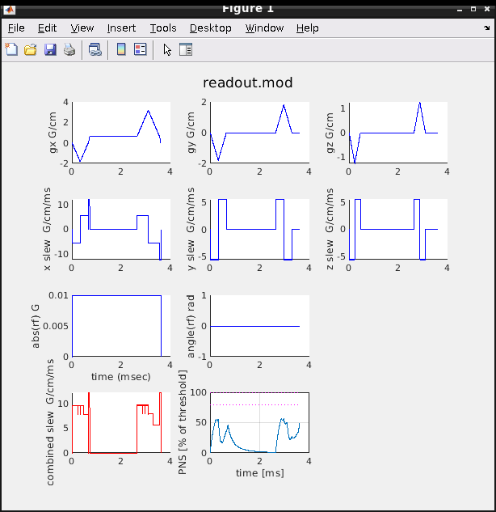
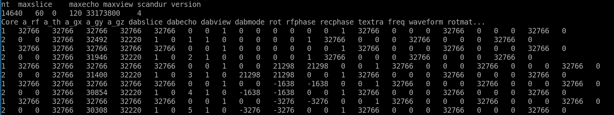

# TOPPE sequence files

The TOPPE interpreter is a 'universal' pulse sequence description (PSD) 
executable that loads all RF and gradient waveforms from external `.mod` files,
and executes those waveforms according to the instructions listed in `scanloop.txt`.
The various `.mod` files are listed in yet another file, conventionally named `modules.txt`.
Thus, several different files operate in concert to specify the pulse sequence:


See the [README](README.md) in this repository for example usage.


## toppe\<CV1\>.entry

This text file is the entry point for the interpreter, and must be located 
in **/usr/g/research/pulseq/** on the scanner host computer.
CV1 is the (non-negative) integer entered on the Advanced tab (user CV screen)
on the host user interface (UI) (see [README.md](README.md)).
For example, if CV1 = 0 (the default value), the entry point is the file `toppe0.entry`.
CV1 is saved with the protocol.

In our example 3D GRE sequence, the file name is **toppe0.entry** and contains:
```
/usr/g/research/pulseq/gre/
modules.txt
scanloop.txt
tipdown.mod
readout.mod
seqstamp.txt
```
The 1st line is the name of the folder where the scan files reside. This can be any folder on the scanner host computer.   
The 2nd line is a text file listing all `.mod` files needed for this particular scan (more below),  
conventionally named `modules.txt`.  
The 3rd line is the name of the file specifying the scan loop, conventionally named `scanloop.txt`.
The 4th and 5th lines are the `.mod` files used for B1 scaling and ADC setup, respectively.  
These .mod files are also typically listed in modules.txt, but that's not a requirement.  
The last line is the name of a file containing safety and hardware information, 
that is generated by toppe.preflightcheck().  

In this example, all scan files (i.e., the files listed in toppe0.entry, and all .mod files
listed in modules.txt) must be placed in **/usr/g/research/pulseq/gre/** on the scanner host.

Note that the toppe\<CV1\>.entry file is _not_ used by the Matlab toolbox (e.g., when plotting), 
except by the function `toppe.preflightcheck()`.


## modules.txt

This is a simple and (typically) brief text file that lists the various `.mod`
files that make up the sequence.
In our example, there are only two modules:
`tipdown.mod`, which defines a hard RF excitation without any gradients, and
`readout.mod`, a module containing readout, phase-encode, and partition-encoding gradients at full amplitude.

Example:
```
Total number of unique cores
2
fname  duration(us)    hasRF?  hasDAQ?
tipdown.mod     0       1       0
readout.mod     0       0       1
```

There is one line for each .mod file, with each line containing four (tab-separated) columns:

| Column | Description | Unit/Type |
| ---    | ---   | ---         |
| 1 | string | name of .mod file | text string |
| 2 | duration of module (us). This is typically set to 0, which indicates that the minimum duration for that .mod file will be used. | integer |
| 3 | Set to 1 if module is an excitation module, 0 otherwise | integer (0 or 1) |
| 4 | Set to 1 if module is an acquisition module, 0 otherwise | integer (0 or 1) |

A module cannot be simultaneously used for both RF excitation and data acquisition.


## tipdown.mod and readout.mod 

The `.mod` file format is a custom format that is used for both RF excitation, readout, 
and gradient-only modules.
To plot the contents of these files, do:
```
>> toppe.plotseq('tipdown.mod');
>> toppe.plotseq('readout.mod', 'gradcoil', 'xrm');
```




The excitation module contains a hard RF pulse and no gradients.  
The readout module contains 3D FFT readout waveforms **at full amplitude**; 
these waveforms are scaled down as needed during the scan as specified in `scanloop.txt`.
These waveforms are placed along **logical gradient axes** in the .mod file, 
i.e., they will be converted to physical gradients on the scanner 
based on the scan rotation specified on the UI as well as in `scanloop.txt`.
It is a convention to place the 'readout' waveform on the logical 'gx' gradient axis,
but that's not a requirement and you may place any waveform on any axis.


## scanloop.txt

Finally, the complete scan loop is specified in the file listed in 
line 3 in the `toppe<CV1>.entry` file. 
Conventionally, this is named `scanloop.txt`, but this is not a requirement.
This file contains various hardware instructions, and is 
**created using the `toppe.write2loop()` Matlab function**.
See examples/3DGRE/gre.m for an up-to-date example of how to use `toppe.write2loop()`.

For completeness, a detailed description follows.

Example:


Line 2 contains the following (tab-separated) values:

| Column | Description | Unit/Type |
| ---    | ---   | ---         |
| 1 | number of .mod file executions (rows in this file) | integer |
| 2 | maximum 'slice' index (data storage) | even positive integer |
| 3 | maximum 'echo' index (data storage) | even non-negative integer |
| 4 | maximum 'view' index (data storage) | even positive integer |
| 5 | scan duration (us) | positive integer |
| 6 | TOPPE version | integer (must be 4 at present) |

Each subsequent row must contain the following tab-separated values:

| Column | Description | Unit/Type |
| ---    | ---   | ---       |
| 1 | module number (row in `modules.txt`) | positive integer |
| 2 | rf waveform (RHO) amplitude | signed even int16 (hardware units; 32766 = full scale) |
| 3 | rf phase waveform (THETA) amplitude | signed even int16 (hardware units; 32766 = full scale) |
| 4 | logical x gradient amplitude | signed even int16 (hardware units; 32766 = full scale) |
| 5 | logical y gradient amplitude | signed even int16 (hardware units; 32766 = full scale) |
| 6 | logical z gradient amplitude | signed even int16 (hardware units; 32766 = full scale) |
| 7 | data storage 'slice' index | positive int, starting at 1 |
| 8 | data storage 'echo ' index | non-negative int, starting at 0 |
| 9 | data storage 'view' index | positive int, starting at 1 |
| 10 | turn on/off data acquisition| 0 (off) or 1 (on) |
| 11 | In-plane rotation (no longer used) | signed even int16 (hardware units; +32766 = +pi) |
| 12 | RF transmit phase | signed even int16 (hardware units; +32766 = +pi) |
| 13 | receive phase | signed even int16 (hardware units; +32766 = +pi) |
| 14 | extend module duration ('textra') | integer, microseconds |
| 15 | RF transmit frequency | integer, Hz |
| 16 | Waveform number (index) in .mod file | positive integer, starting at 1 |
| 17-25 | 3x3 rotation matrix | signed even int16 (hardware units; +32766 = +1.0) |
| 26 | cardiac trigger mode | 0: off; 1: on |


