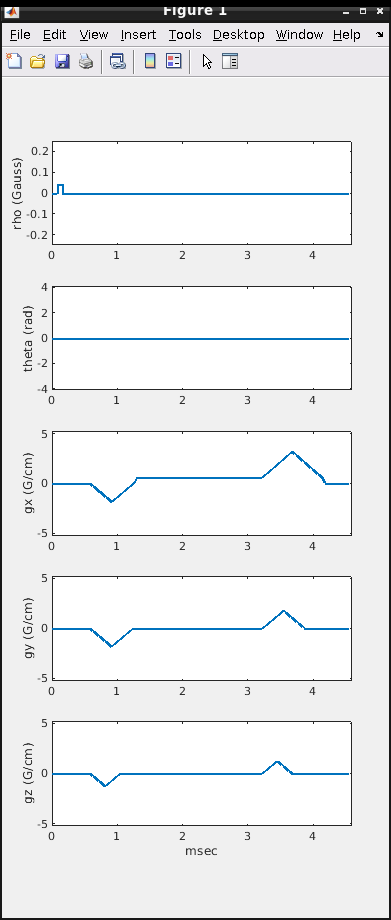

# TOPPE Matlab toolbox

TOPPE is a modular framework for rapid prototyping of pulse sequences on General Electric MRI scanners.
For an overview, see <https://toppemri.github.io/>.

TOPPE can be used on its own, or as the GE interpreter for [Pulseq](http://pulseq.github.io/); 
the latter allows MR sequences to be ported across vendor platforms (currently, Siemens and GE are supported).
For more information on converting to/from Pulseq, see <https://github.com/toppeMRI/PulseGEq>.

This repository contains various basic functions for writing and reading TOPPE scan files, that are
then simply copied to the scanner host computer and loaded by the TOPPE interpreter for execution.
The interpreter (EPIC source code) is hosted in a 
[separate repository](https://github.com/jfnielsen/TOPPEpsdSourceCode) -- for access, contact jfnielse@umich.edu.


## Example sequence: 3D GRE

The [examples/3DGRE](examples/3DGRE) folder contains the Matlab function `gre.m`, that
creates a set of [TOPPE files](Files.md) that together define a 3D RF-spoiled gradient-echo sequence.

For a detailed explanation of these files,
see [Files.md](Files.md).


### Create the sequence files

1. Get this toolbox and enter the example directory
```
$ git clone git@github.com:toppeMRI/toppe.git
>> cd examples/3DGRE
```
1. (optional) Edit gre.m to set the desired FOV and matrix size, and scanner hardware specs.
1. Create the GRE scan files.
In Matlab:
```
>> addpath ../..   % folder containing the +toppe package
>> sys = gre; 
```
This creates the files `modules.txt`, `scanloop.txt`, `seqstamp.txt`, and two `.mod` files (`tipdown.mod` and `readout.mod`).
The return value is a struct containing hardware parameters, that is needed for plotting.

### Plot the sequence

```
>> iStart = 1; iStop = 2;  % row numbers in scanloop.txt
>> toppe.plotseq(iStart, iStop, sys, 'moduleListFile', 'modules.txt', 'loopFile', 'scanloop.txt');
```




### Plot the individual .mod files

The `.mod` file format is a custom format that is used for both RF excitation, readout, 
and gradient-only modules.
To plot the contents of these files, do:
```
>> toppe.plotseq('tipdown.mod');
>> toppe.plotseq('readout.mod', 'gradcoil', 'xrm');
```


### Preview the scan

```
>> nModulesPerTR = 2;
>> toppe.playseq(nModulesPerTR, sys, 'moduleListFile', 'modules.txt', 'loopFile', 'scanloop.txt', 'tpause', 0.01, 'nTRskip', 10);
```

You should observe that the phase- and partition-encoding gradient amplitudes, 
and the RF phase, are changing.


### Execute this sequence on the scanner

1. Place `modules.txt`, `scanloop.txt`, `seqstamp.txt`, and  the two `.mod` files 
   in **/usr/g/research/pulseq/gre/** on the scanner host computer.
1. Copy the file `toppe0.entry` to **/usr/g/research/pulseq/** on scanner host. This is the entry point for the interpreter.
1. Run the interpreter. For details, see the README file in the [intepreter source code repository](https://github.com/jfnielsen/TOPPEpsdSourceCode)
```


